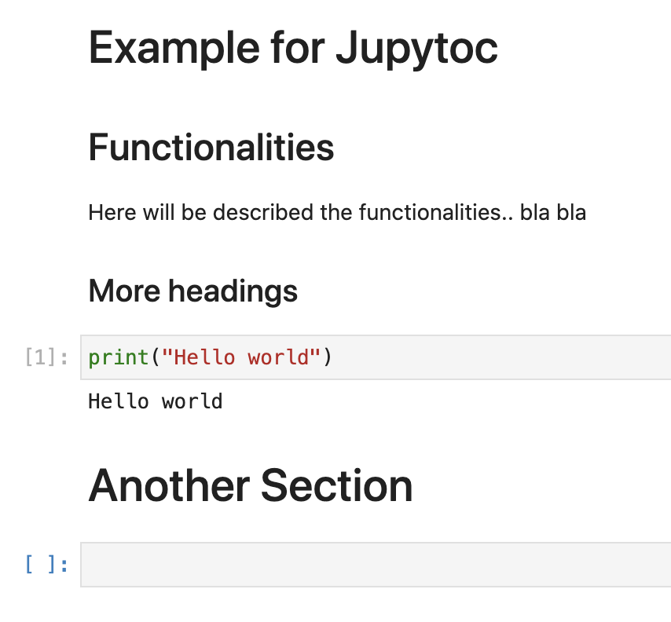
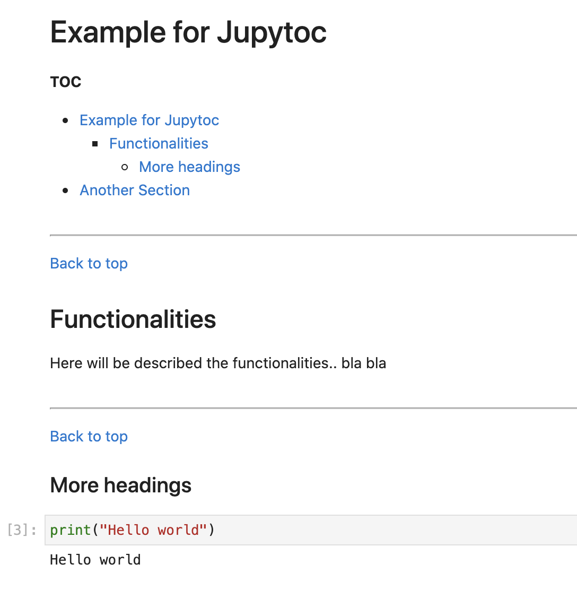

# JUPYTOC

Short python script to create a markdown table of contents (TOC) cell at the top of a notebook, from parsed headings.
The TOC cell generated will also have hyperlinks, to referenced cells

## Usage
`python jupytoc.jupytoc -n <path-to-notebook> -o <output-path>`

Example:

`git clone https://github.com/bru08/jupytoc.git`
`cd jupytoc`
`python jupytoc -n examples/example.ipynb -o examples/out_example_toc.ipynb`

Original notebook

After running `jupytoc`

